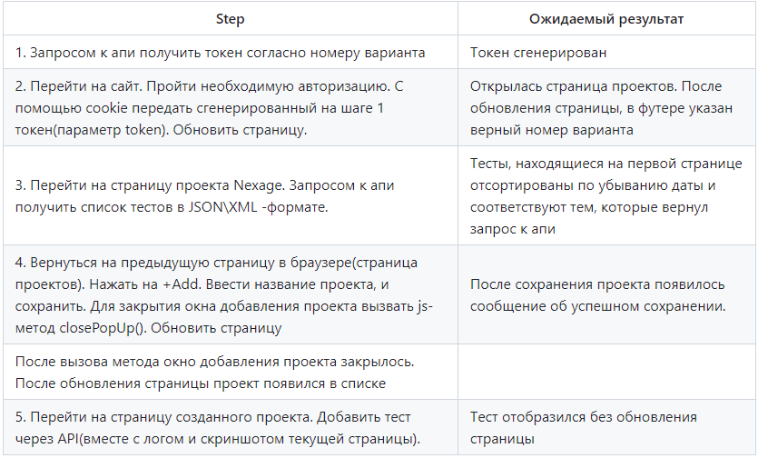

Финальное задание со стажировки. 
This is the final task of the internship.

Необходимо было реализовать автоматизированный тест web-приложения (UI + API)
Обязательным условием является использование паттернов Page Objects и Page Elements.

Final task from the internship. It was necessary to implement an automated test of a web application (UI + API). 
A prerequisite is the use of the Page Objects and Page Elements patterns.

Тест кейс №1 (firstTest):

Тест кейс №2 (secondTest):

1. Тестируемое приложение необходимо было развернуть помощью докера на http://localhost:8080/web
2. Запросы к API выполнялись согласно документации, в которой описаны все методы.

1. The application under test is deployed using docker to http://localhost:8080/web
2. API requests were made according to the documentation. The documentation describes all methods.
